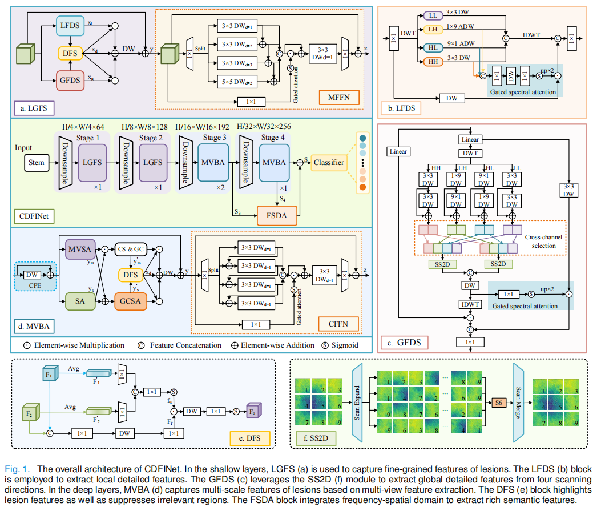
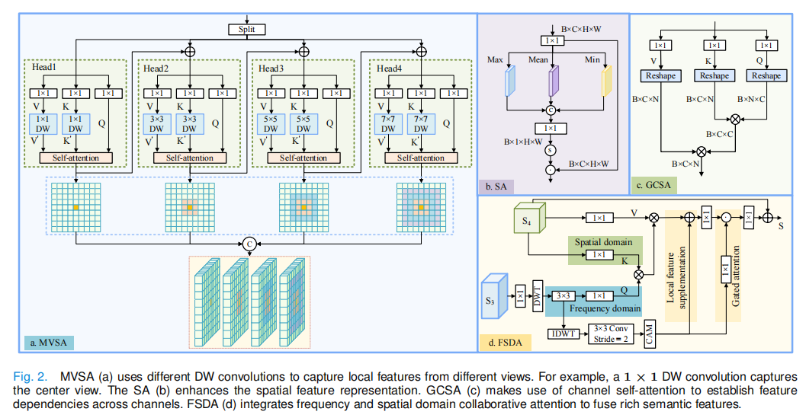

# Cross-Domain Feature Interaction: A Robust Generalization Network for Cross-Category Medical Image Classification
This is a public repository of CDFINet. Our repository will continue to be updated soon.
# Abstract
Accurate medical image classification is crucial in early diagnosis and treatment of diseases. However, the high heterogeneity among different medical images leads to the prevalence of networks designed for single medical image classification. In contrast, universal medical image classification networks have stronger generalization and scalability in multi-source datasets. To this end, based on multi-scale frequency-spatial domain analysis, we propose a novel cross-domain feature interaction network (CDFINet) for medical image classification. Primarily, the Local-Global Frequency-domain Scan (LGFS) block is designed to extract fine-grained features of lesions, enhancing spatial detailed feature representation by introducing gated spectral attention. Drawing on feature extraction of the "center-local-global" multi-view, the Multi-View Bi-dimensional Attention (MVBA) block is devised to capture multi-scale features by modeling global multi-scale contextual dependencies. To extract rich semantic features more effectively, the Frequency-Spatial Domain Attention (FSDA) block is designed to guide the network to focus on lesion regions by leveraging the similarity of spectral-spatial features. To verify the generalization of CDFINet, experiments are conducted on gastrointestinal disease, skin disease, breast cancer histopathology, and chest X-ray datasets. The accuracy of CDFINet on the gastrointestinal disease classification is 90.47%, which is 8.27% higher than that of SPANet (2024), 4.8% higher than that of HiFuse (2024), and 3.84% higher than that of MedMamba (2024).  CDFINet not only achieves state-of-the-art (SOTA) performance but also has fewer parameters and
less computational cost. 
# Overview
## Overall architecture of CDFINet

# Acknowledgements
We thank the authors of [Mamba](https://github.com/state-spaces/mamba) , [VMamba](https://github.com/MzeroMiko/VMamba), [Wave-ViT](https://github.com/YehLi/ImageNetModel) for making their valuable code & data publicly available.