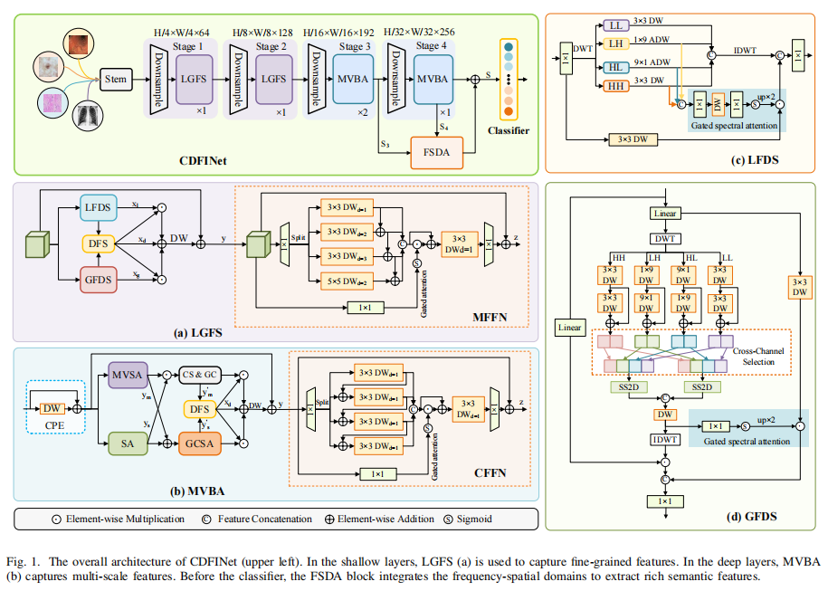
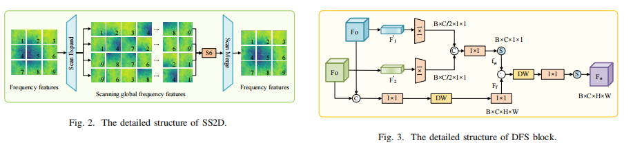
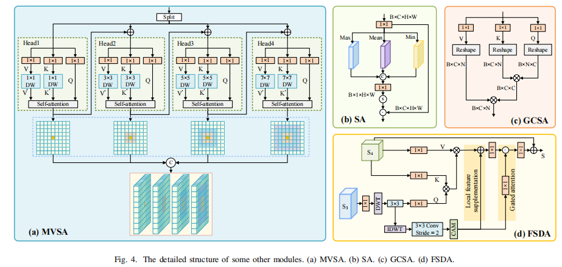
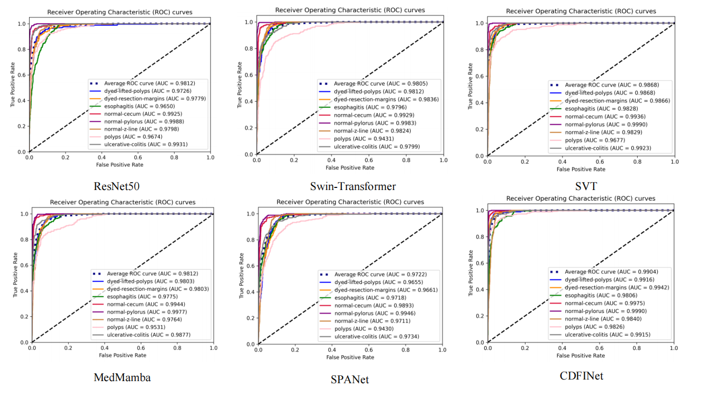
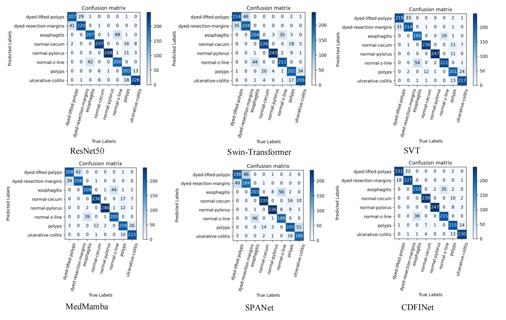
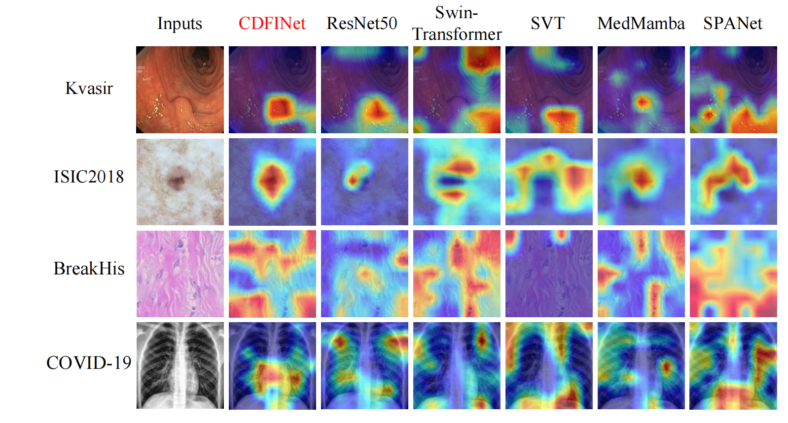

# Cross-Domain Feature Interaction: A Robust Generalization Network for Cross-Category Medical Image Classification
This is a public repository of CDFINet. Our repository will continue to be updated soon.
# Overview
## Overall architecture of CDFINet

# Visualization Results
## ROC curves
The ROC curve provides a visual way to determine which model performs better in a classification task. The area under the curve (AUC) is a commonly used metric. The closer the AUC value is to 1, the better the model's classification performance. ROC curves are shown on the Kvasir dataset to comprehensively assess the performance of different networks. The area under the curve (AUC) of CDFINet is 0.9904, which is significantly higher than that of other networks.

## Confusion matrices
In addition, confusion matrices reflect the performance of different networks to classify lesions. These networks tend to be confused in classifying esophagitis and normal Z lines, mainly because the site of esophagitis is often located near the Z lines. Therefore, in cases where inflammation is not evident will result in less accuracy in classifying esophagitis and Z-lines. Overall, CDFINet achieves a higher accuracy compared to other networks.

## Grad-CAM visualization

# Acknowledgements
We thank the authors of [Mamba](https://github.com/state-spaces/mamba) , [VMamba](https://github.com/MzeroMiko/VMamba), [Wave-ViT](https://github.com/YehLi/ImageNetModel) for making their valuable code & data publicly available.